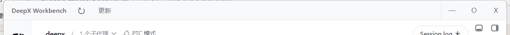
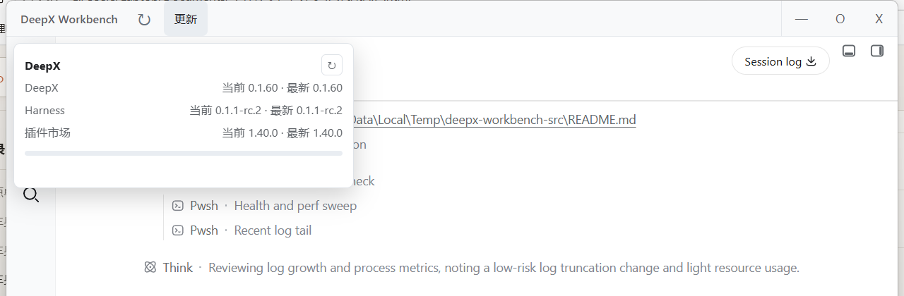

<p align="center"></p>

# DeepX Workbench

**[English](README.md)**

[](https://github.com/JeremyWangCY/deepx-workbench/actions/workflows/ci.yml)
[](https://github.com/JeremyWangCY/deepx-workbench/releases/latest)
[](LICENSE)

DeepX Workbench 是官方 DeepSeek Harness 运行时的独立 clean-room 桌面外壳。
它**不是** `deepseek-harness-desktop` 的 fork：自带极简 Vite 前端和自研
Rust/Tauri 宿主，与官方唯一的兼容面是 Harness 运行时与 CLI：

- 本地 Harness HTTP 服务 `127.0.0.1:3080`
- `dsh --profile web --no-open --port 3080`
- `dsh plugin --profile web add dshmarket`
- 官方 npm 包 `@deepseek-ai/dsh`

## 开箱即得

一个直接承载 Harness 的无边框桌面窗口，页面顶部注入一条原生感顶栏：



| 控件 | 动作 |
|---|---|
| `DeepX Workbench` 标题区（拖拽） | 移动窗口（标准拖拽） |
| ↻ 刷新 | 原地重载 Harness 页面 |
| 更新 | 在下方打开更新面板 |
| — / O / × | 最小化、最大化/还原、隐藏到托盘 |

**更新面板**按需检查“已安装 vs 最新”版本并执行更新 —— DeepX 本体、
Harness 运行时、插件市场：



- **刷新状态** —— 重新检查 DeepX、Harness、插件市场的当前/最新版本。
- **更新 Harness** —— 停止服务 → 安装最新版 → 重启 → 返回页面，进度内联显示。
- **安装 / 更新插件市场** —— 用官方 `dsh plugin` CLI + 内置 pnpm 运行时安装
  或更新 `dshmarket`。

系统托盘图标提供显示 / 刷新 / 重启 Harness / 更新 / 退出（含左键还原）。
应用保证单实例：重复启动只会还原已有窗口，不会再开一个。

## 安装

从 [Releases](https://github.com/JeremyWangCY/deepx-workbench/releases/latest)
下载 Windows x64 NSIS 安装包（文件名形如
`DeepX.Workbench_<版本号>_x64-setup.exe`）。按用户安装，无需管理员权限。

安装包内置经过测试的私有 Node.js 运行时和官方 DeepSeek Harness 运行时。
首次运行时 DeepX 把本地 Harness、私有 pnpm 运行时、预装插件市场复制到
应用数据目录 —— 安装时**不**下载 Node.js 也不跑 npm。复制完成后 Harness
直接在窗口中打开。

日常启动不做任何依赖安装。私有 pnpm 环境和插件市场在首次运行后就绪；
之后的 Harness 与市场更新都是用户显式触发，需要联网。

## 设计目标

- 启动面极简，直达 Harness。
- 不经过默认浏览器，Harness 界面留在 DeepX 内。
- 单应用实例；快捷方式可还原最小化或托盘隐藏的窗口。
- 使用默认 `~/.dsh` web profile，与已有 Harness 插件共享。
- 不重复安装依赖。
- 更新全部由用户显式触发，目标永远是最新发布版。
- 首次运行即带 pnpm 与可用插件市场。
- 保护 Harness profile 与用户已装插件（绝不触碰）。
- 顶栏扛得住页面重载：每次页面加载重新注入，主线程看门狗约每 1.6 秒
  重新确认一次；健康检查只接受完全接线的顶栏（元素已连接、所属闭包持有
  可用 IPC 绑定）；按钮在点击时刻解析 IPC，永不失声。

## 开发

安装 Node.js 与 pnpm，然后：

```bash
pnpm install
pnpm tauri dev
```

构建安装包：

```bash
pnpm tauri build
```

Release 构建由标签（`v*`）经 `.github/workflows/release.yml` 触发：
版本校验 → 依赖安装 → 运行时准备 → `pnpm typecheck` +
`cargo clippy -- -D warnings` → NSIS 构建 → 运行时归档 → GitHub Release。
贡献命令、提交规范、发布步骤见 [CONTRIBUTING.md](CONTRIBUTING.md)。
安全问题见 [SECURITY.md](SECURITY.md)。

## 文档

- [CHANGELOG.md](CHANGELOG.md) —— 逐版本说明。
- [docs/QA.md](docs/QA.md) —— 人工验证记录。

## License

[MIT](LICENSE)
